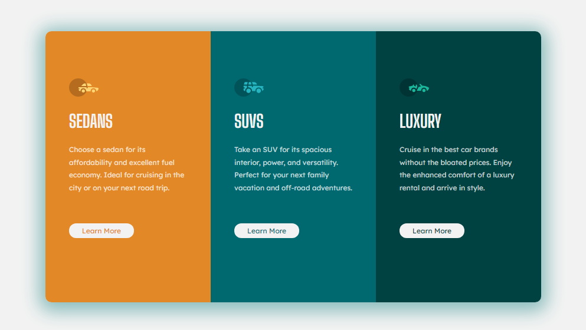

# Frontend Mentor - 3-column preview card component solution

This is a solution to the [3-column preview card component challenge on Frontend Mentor](https://www.frontendmentor.io/challenges/3column-preview-card-component-pH92eAR2-). Frontend Mentor challenges help you improve your coding skills by building realistic projects. 

## Table of contents

- [Overview](#overview)
  - [The challenge](#the-challenge)
  - [Screenshot](#screenshot)
- [My process](#my-process)
  - [Built with](#built-with)
  - [What I learned](#what-i-learned)

## Overview

### The challenge

Users should be able to:

- View the optimal layout depending on their device's screen size
- See hover states for interactive elements

### Screenshot



## My process

### Built with

- Semantic HTML5 markup
- CSS custom properties

### What I learned

It was a nice repetition of my skills.
Some code:

```html
    <div class="column1">
        
        <h1>Sedans</h1>
        <p>Choose a sedan for its affordability and excellent fuel economy. 
            Ideal for cruising in the city or on your next road trip.</p>
        <div class="button1">Learn More</div>
    </div>
```
```css
.button1
{
    background-color: var(--very_light_gray);
    margin-top: 50px;
    width: 100px;
    border-radius: 12px;
    text-align: center;
    padding: 5px;

    color: var(--bright_orange);
}
.button1:hover {
    background-color: var(--transparent_white);
}
```
